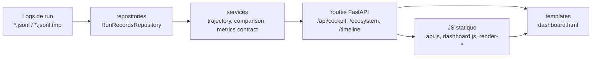

# Dashboard Singular

Ce document décrit le tableau de bord web Singular : prérequis, lancement,
endpoints principaux, flux de données et familles de métriques exposées.

## Prérequis

- Python 3.10 ou plus récent.
- Installer le projet avec les dépendances dashboard :

  ```bash
  pip install -e .[dashboard]
  ```

- Avoir une vie Singular initialisée ou un `SINGULAR_HOME` pointant vers un home
  contenant au minimum `mem/` et, idéalement, des logs dans `runs/*.jsonl` ou
  `runs/*.jsonl.tmp`.
- Pour les actions mutatives depuis l'interface, définir un jeton :

  ```bash
  export SINGULAR_DASHBOARD_ACTION_TOKEN='change-me'
  ```

  En développement local uniquement, il est possible d'autoriser les actions non
  authentifiées avec `SINGULAR_DASHBOARD_ALLOW_UNAUTHENTICATED_ACTIONS=1`.

## Commandes de lancement

Point d'entrée CLI principal :

```bash
singular dashboard
```

Depuis un checkout source sans console script installé :

```bash
python scripts/run_dashboard.py --host 127.0.0.1 --port 8000
```

Le dashboard écoute par défaut sur `http://127.0.0.1:8000/`.

## Endpoints principaux

| Endpoint | Rôle |
| --- | --- |
| `GET /` | Page HTML du cockpit et des panneaux interactifs. |
| `GET /dashboard/context` | Contexte registre/home actif, état d'onboarding, vies connues. |
| `GET /api/cockpit` | Vue complète : santé, alertes, mémoire, ressources, performances, relations sociales, mutations et décisions. |
| `GET /api/cockpit/essential` | Projection courte pour supervision rapide. |
| `GET /runs/latest` | Dernier run et ses enregistrements JSONL. |
| `GET /api/runs/{run_id}/timeline` | Timeline filtrable d'un run : mutations, refus, délais, décès, sandbox et décisions de gouvernance. |
| `GET /api/runs/{run_id}/consciousness` | Journal de conscience compagnon quand il existe. |
| `GET /api/runs/{run_id}/mutations/{index}` | Détail d'une mutation : décision, diff, métriques et contexte. |
| `GET /mutations/top` | Mutations les plus bénéfiques, risquées et fréquentes. |
| `GET /ecosystem` | Organismes/vies, énergie, ressources et contrat de compteurs. |
| `GET /lives/comparison` | Comparaison multi-vies et métriques de vivacité. |
| `GET /lives/genealogy` | Parentés, alliances, rivalités et conflits actifs. |
| `GET /api/dashboard/work-items` | Objectifs, conversations et éléments de travail affichables. |
| `POST /api/actions/{action}` | Exécution contrôlée d'actions (`birth`, `talk`, `loop`, `report`, `archive`, `memorial`, `clone`, `emergency_stop`). |
| `GET /api/retention/status` | Statut de rétention et diagnostics de stockage. |

## Données affichées

Le cockpit agrège plusieurs familles de signaux :

- **Mémoire** : signaux mémoire/reflection dans les runs, taille de la timeline
  causale et dernier souvenir détecté (`memory_metrics`).
- **Ressources** : énergie, ressources, organismes/vies vivantes et totales via
  `vital_metrics.energy_resources` et `/ecosystem`.
- **Performances** : volumes de records/mutations, acceptations/rejets, durées,
  latences et delta moyen de score (`performance_metrics`).
- **Relations sociales** : alliances, rivalités, interactions et échanges de
  ressources (`social_relations`, `/lives/genealogy`).
- **Mutations** : taux d'acceptation, dernière mutation notable, détails de diff
  et classements `/mutations/top`.
- **Décisions majeures** : mutations, refus, délais, décès, événements
  orchestrateur et gouvernance/sandbox récents (`major_decisions`).
- **Vie et santé** : score de santé, cycle circadien, objectifs actifs, risques,
  génération de code, vivacité et trajectoire.
- **Hôte** : CPU, RAM, température, disque et adaptations capteurs dans le
  contexte retourné après les actions dashboard.

## Flux de données



Le dépôt `RunRecordsRepository` tolère les lignes JSON invalides et les fichiers
temporaires en cours d'écriture. Les services transforment ensuite les records en
contrats stables avant exposition par les routes FastAPI et rendu côté navigateur.
