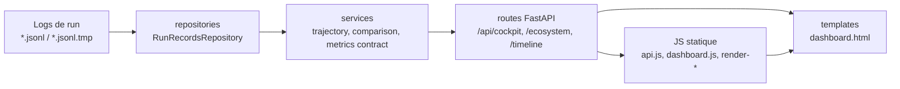

# Dashboard Singular

Ce document décrit le tableau de bord web Singular : prérequis, lancement,
endpoints principaux, flux de données et familles de métriques exposées.

## Prérequis

- Python 3.10 ou plus récent.
- Installer le projet avec les dépendances dashboard :

  ```bash
  pip install -e .[dashboard]
  ```

- Avoir une vie Singular initialisée ou un `SINGULAR_HOME` pointant vers un home
  contenant au minimum `mem/` et, idéalement, des logs dans `runs/*.jsonl` ou
  `runs/*.jsonl.tmp`.
- Pour les actions mutatives depuis l'interface, définir un jeton :

  ```bash
  export SINGULAR_DASHBOARD_ACTION_TOKEN='change-me'
  ```

  En développement local uniquement, il est possible d'autoriser les actions non
  authentifiées avec `SINGULAR_DASHBOARD_ALLOW_UNAUTHENTICATED_ACTIONS=1`.

## Commandes de lancement

Point d'entrée CLI principal :

```bash
singular dashboard
```

Depuis un checkout source sans console script installé :

```bash
python scripts/run_dashboard.py --host 127.0.0.1 --port 8000
```

Le dashboard écoute par défaut sur `http://127.0.0.1:8000/`.

## Endpoints principaux

| Endpoint | Rôle |
| --- | --- |
| `GET /` | Page HTML du cockpit et des panneaux interactifs. |
| `GET /dashboard/context` | Contexte registre/home actif, état d'onboarding, vies connues. |
| `GET /api/cockpit` | Vue complète : santé, alertes, mémoire, ressources, performances, relations sociales, mutations et décisions. |
| `GET /api/cockpit/essential` | Projection courte pour supervision rapide. |
| `GET /runs/latest` | Dernier run et ses enregistrements JSONL. |
| `GET /api/runs/{run_id}/timeline` | Timeline filtrable d'un run : mutations, refus, délais, décès, sandbox et décisions de gouvernance. |
| `GET /api/runs/{run_id}/consciousness` | Journal de conscience compagnon quand il existe. |
| `GET /api/runs/{run_id}/mutations/{index}` | Détail d'une mutation : décision, diff, métriques et contexte. |
| `GET /mutations/top` | Mutations les plus bénéfiques, risquées et fréquentes. |
| `GET /ecosystem` | Organismes/vies, énergie, ressources et contrat de compteurs. |
| `GET /lives/comparison` | Comparaison multi-vies et métriques de vivacité. |
| `GET /lives/genealogy` | Parentés, alliances, rivalités et conflits actifs. |
| `GET /api/dashboard/work-items` | Objectifs, conversations et éléments de travail affichables. |
| `POST /api/actions/{action}` | Exécution contrôlée d'actions (`birth`, `talk`, `loop`, `report`, `archive`, `memorial`, `clone`, `emergency_stop`). |
| `GET /api/retention/status` | Statut de rétention et diagnostics de stockage. |

## Authentification et reverse proxy

Les routes mutatives (`POST /api/actions/{action}` et le chat) acceptent le
jeton **uniquement** dans `Authorization: Bearer <jeton>` ou dans
`X-Singular-Action-Token: <jeton>`. Le jeton ne doit jamais être placé dans la
query string ou le JSON. Toutes les actions via `GET` sont refusées avec 405,
y compris `birth`, `loop`, `talk` et la sélection d'une vie.

Une écoute sur une adresse autre que `127.0.0.1`, `localhost` ou `::1` active
également cette authentification sur toutes les lectures (hors fichiers
statiques) et sur `/ws`. Derrière un reverse proxy, conserver l'en-tête
`Authorization` ou `X-Singular-Action-Token`, utiliser HTTPS, et configurer le
proxy pour ne pas journaliser ces en-têtes. Les URLs peuvent être journalisées
normalement puisqu'elles ne contiennent aucun secret. L'override de
développement non authentifié ne doit jamais être employé sur une écoute
publique.

Le proxy doit aussi transmettre explicitement l'upgrade WebSocket. Par exemple,
avec nginx (le bloc `location` doit correspondre au chemin public retenu) :

```nginx
location /ws {
    proxy_pass http://127.0.0.1:8000/ws;
    proxy_http_version 1.1;
    proxy_set_header Upgrade $http_upgrade;
    proxy_set_header Connection "upgrade";
    proxy_set_header Host $host;
}
```

Le navigateur sélectionne automatiquement `ws:` pour une page HTTP et `wss:`
pour une page HTTPS. Si le dashboard est publié sous un sous-chemin (par exemple
`/singular/dashboard`), définir le préfixe avant de charger le module du
dashboard, puis exposer le WebSocket au chemin préfixé correspondant :

```html
<script>window.SINGULAR_DASHBOARD_PATH_PREFIX = '/singular/dashboard';</script>
<script type="module" src="/singular/dashboard/static/dashboard.js"></script>
```

Dans cet exemple, le client se connecte à `/singular/dashboard/ws`; le reverse
proxy doit router ce chemin vers `/ws` sur le service Singular en conservant les
en-têtes `Upgrade`, `Connection` et `Host` montrés ci-dessus.

## Données affichées

Le cockpit agrège plusieurs familles de signaux :

- **Mémoire** : signaux mémoire/reflection dans les runs, taille de la timeline
  causale et dernier souvenir détecté (`memory_metrics`).
- **Ressources** : énergie, ressources, organismes/vies vivantes et totales via
  `vital_metrics.energy_resources` et `/ecosystem`.
- **Performances** : volumes de records/mutations, acceptations/rejets, durées,
  latences et delta moyen de score (`performance_metrics`).
- **Relations sociales** : alliances, rivalités, interactions et échanges de
  ressources (`social_relations`, `/lives/genealogy`).
- **Mutations** : taux d'acceptation, dernière mutation notable, détails de diff
  et classements `/mutations/top`.
- **Décisions majeures** : mutations, refus, délais, décès, événements
  orchestrateur et gouvernance/sandbox récents (`major_decisions`).
- **Vie et santé** : score de santé, cycle circadien, objectifs actifs, risques,
  génération de code, vivacité et trajectoire.
- **Hôte** : CPU, RAM, température, disque et adaptations capteurs dans le
  contexte retourné après les actions dashboard.

## Flux de données


```mermaid
flowchart LR
    A[Logs de run\n*.jsonl / *.jsonl.tmp] --> B[repositories\nRunRecordsRepository]
    B --> C[services\ntrajectory, comparison, metrics contract]
    C --> D[routes FastAPI\n/api/cockpit, /ecosystem, /timeline]
    D --> E[templates\ndashboard.html]
    D --> F[JS statique\napi.js, dashboard.js, render-*]
    F --> E
```

Le dépôt `RunRecordsRepository` tolère les lignes JSON invalides et les fichiers
temporaires en cours d'écriture. Les services transforment ensuite les records en
contrats stables avant exposition par les routes FastAPI et rendu côté navigateur.

## Indices auditables et diagnostic

Chaque indice de `/lives/comparison` expose `formula_version`, `formula`, `unit`,
`window`, `components`, `freshness`, `confidence`, `missing_data`, `proofs` et
`recommendations` dans `score_diagnostics`. Une valeur ne doit donc pas être lue
sans sa fenêtre, sa fraîcheur et son niveau de confiance.

| Indice (version) | Formule et unité | Fenêtre | Seuils indicatifs |
| --- | --- | --- | --- |
| Vivacité (`liveness-v1.0`) | `100 × (activité + boucle PDA + objectifs/progrès + interactions + modifications validées) / 5`, chaque composante valant 0, 0,5 ou 1 ; points/100 | activité 24 h, perception→décision→action 48 h, interactions 7 j, historique disponible pour objectifs et modifications | `< 40` faible, `40–79,9` partielle, `≥ 80` étayée |
| Autonomie (`autonomy-v1.0`) | même formule que la vivacité après exclusion des arrêts volontaires de budget ; points/100 | mêmes fenêtres | mêmes seuils ; `excluded_records` explique l'écart avec la vivacité |
| Viabilité mutation (`mutation-viability-v1.0`) | `100 × clamp(0, 1, 0,5 × taux d'acceptation + 0,5 × taux d'utilité − 0,25 × taux d'échec)` ; points/100 | mutations de l'historique disponible | confiance faible `< 3`, moyenne `3–9`, haute `≥ 10` mutations |
| Santé (`health-observation-v1.0`) | dernière valeur observée de `health.score` ; points/100 | filtre demandé (`24h`, `7d`, `30d`, `all`) | confiance faible avec 0–1, moyenne avec 2–4, haute avec ≥ 5 observations |

La fraîcheur est `fresh` jusqu'à 24 h, `stale` entre 24 h et 7 jours,
`expired` au-delà, ou `missing` sans horodatage. La confiance de vivacité mesure
la couverture des cinq composantes, pas la probabilité que la vie soit « saine ».

### Limites d'interprétation

- Ces indices décrivent les événements journalisés : une activité réelle non
  enregistrée reste une donnée manquante et peut abaisser artificiellement le score.
- Les composantes ont un poids égal ; le score ne mesure ni conscience, ni qualité
  morale, ni valeur intrinsèque d'une vie.
- Une corrélation temporelle ou une variation de santé n'établit pas une causalité.
  Le panneau affiche donc les preuves contributrices et formule la « raison » comme
  une décomposition observée.
- Comparer deux vies n'est pertinent qu'avec les mêmes fenêtres et une fraîcheur
  comparable. Un score absent n'est jamais équivalent à zéro.
- Les seuils sont des repères opératoires, pas des seuils cliniques ou statistiques.

### Exemples de diagnostic

**Vivacité à 60/100.** Activité, boucle PDA et objectif progressant valent 1,
mais interactions et modifications validées valent 0. Si aucune interaction n'est
journalisée sur sept jours, l'interface propose concrètement : « Initier un échange
ciblé : aucune interaction observée depuis 7 jours. » Elle ne produit pas une alerte
générique. La recommandation disparaît dès que la composante est étayée.

**Santé en baisse de 8 points.** Avec cinq observations fraîches, le diagnostic
indique `variation de -8.0 points sur 5 observations`, affiche les observations
contributrices et une confiance haute. Il ne prétend pas que la dernière mutation
a causé la baisse.

**Autonomie supérieure à la vivacité.** Si deux événements d'arrêt volontaire de
budget sont exclus, `excluded_records: 2` justifie l'écart. Ce résultat signifie
seulement que ces périodes contrôlées ne pénalisent pas l'indice d'autonomie.
